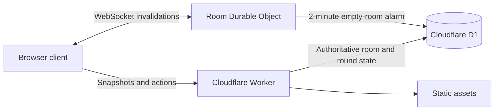

<div align="center">
  

  # MEDIAN — The Beauty Contest

  **Choose a number. Read the room. Survive the average.**

  A server-authoritative, real-time multiplayer interpretation of the classic
  beauty-contest game, built for five players and the web.

  [](https://react.dev/)
  [](https://www.typescriptlang.org/)
  [](https://workers.cloudflare.com/)
  [](https://developers.cloudflare.com/d1/)

  [Play the public build](https://median.mrearthcode.workers.dev) ·
  [Report a bug](https://github.com/frostful/Beauty-Contest/issues) ·
  [Request a feature](https://github.com/frostful/Beauty-Contest/issues)
</div>

---

## About the project

Each player secretly selects a whole number from **0 to 100**. The table finds
the average, multiplies it by **0.8**, and awards the round to the closest valid
choice. A win gains one point; a loss costs one. Reach **−10** and the seat is
eliminated.

Median turns that small mathematical idea into a complete multiplayer game:
private four-letter rooms, live presence, animated calculations, progressive
rule amendments, spectators, reconnects, host controls, bots with distinct
strategies, elimination ceremonies, and a final King of Diamonds coronation.

> This is an unofficial, non-commercial fan project. It is not affiliated with
> Netflix or the creators, publishers, or rights holders of *Alice in
> Borderland*.

## What is included

- Five-seat private rooms with short invite codes
- Real-time updates over hibernatable WebSockets
- Server-authoritative picks, scoring, ties, and eliminations
- Reconnection and human-only host transfer
- Host kick controls and temporary score-testing controls
- Fill-with-bots support with different play personalities
- Spectator mode that never affects the calculation
- Narrated, animated rule-amendment interludes
- Responsive number-line, balance-scale, and result ceremonies
- Privacy policy, terms, and a protected analytics dashboard
- Two-minute cleanup for rooms abandoned by every human player

## How a round works

| Step | Table action |
| --- | --- |
| **A♦ Select** | Every active player locks one integer from 0–100. |
| **J♦ Calculate** | The server finds the average of all valid submitted choices. |
| **Q♦ Target** | The average is multiplied by 0.8. |
| **K♦ Survive** | The closest valid choice gains 1 point; all others lose 1. |

The table adds amendments as players are eliminated: tied numbers may be
sealed, duplicate values can be voided, exact hits can double losses, and the
two-player endgame activates the special **100 defeats 0** rule.

## Architecture



The WebSocket transports tiny invalidation messages rather than duplicating
game state. After an invalidation, each client fetches a fresh authoritative
snapshot from D1. This keeps reconnects deterministic and makes the database,
not an individual browser, the source of truth.

### Built with

- React 19 and TypeScript
- vinext on Cloudflare Workers
- Cloudflare D1 for rooms, players, results, and analytics
- One hibernatable Durable Object per room for presence and expiry alarms
- Drizzle schema and migrations
- Node's built-in test runner

## Getting started

### Prerequisites

- Node.js **22.13 or newer**
- A Cloudflare account for D1, Durable Objects, and production deployment

### Local development

```bash
git clone https://github.com/frostful/Beauty-Contest.git
cd Beauty-Contest
npm install
npm run dev
```

The development server prints its local URL. Open it in separate browser
profiles to test multiple human seats, or create a room and fill the remaining
seats with bots.

### Verification

```bash
npm test
npm run build
```

The announcement rehearsal console is available at:

```text
/?rehearse=announcements
```

It plays the same narration and visuals used between production rounds without
requiring a complete match.

## Deploying to Cloudflare

`wrangler.jsonc` defines the Worker, static assets, D1 database, image binding,
and `ROOM_EVENTS` Durable Object.

```bash
npm run build
npx wrangler d1 migrations apply median-beauty-contest --remote
npx wrangler deploy
```

Set the private admin credential as a Worker secret instead of committing it:

```bash
npx wrangler secret put ADMIN_KEY
```

## Project map

```text
app/                 React pages, game UI, legal pages, and API routes
db/                  Drizzle schema and D1 access
drizzle/             Versioned database migrations
lib/                 Round engine and realtime helpers
public/              Playing-card, atmosphere, and narration assets
tests/               Rules-engine and live smoke tests
worker/              Cloudflare entry point and room Durable Object
wrangler.jsonc       Production bindings and deployment configuration
```

## Privacy and room lifecycle

Median has no user accounts, advertising trackers, payments, or marketing
profiles. A random room credential is stored in the browser so an interrupted
seat can reconnect. Choices remain hidden until the server resolves the round.

When the final connected human leaves or disconnects, the room is retained for
two minutes to allow a quick reconnect. If no human returns, a Durable Object
alarm deletes the room and its related D1 records. Older retained game records
are also covered by the project's published [Privacy Policy](https://median.mrearthcode.workers.dev/privacy).

## Contributing

Bug reports and focused pull requests are welcome. Before opening a PR:

1. Keep scoring and lifecycle decisions server-authoritative.
2. Preserve mobile and desktop behavior.
3. Run `npm test` and `npm run build`.
4. Do not commit secrets, `.env` files, private keys, or Wrangler state.

## Roadmap

- Broader cross-device multiplayer soak testing
- Removal of temporary host score controls before competitive release
- Stronger automated coverage for room lifecycle and realtime reconnects
- Accessibility and reduced-motion review of every ceremony

## License

No open-source license has been granted yet. The source is available for review
and testing, but reuse and redistribution require the copyright holder's
permission until a license file is added.

---

<div align="center">
  Built as a fan-made mathematical strategy game — not an official Netflix product.
</div>
