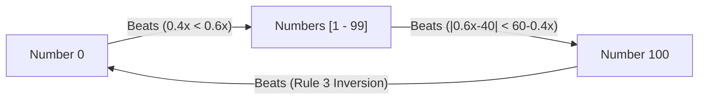
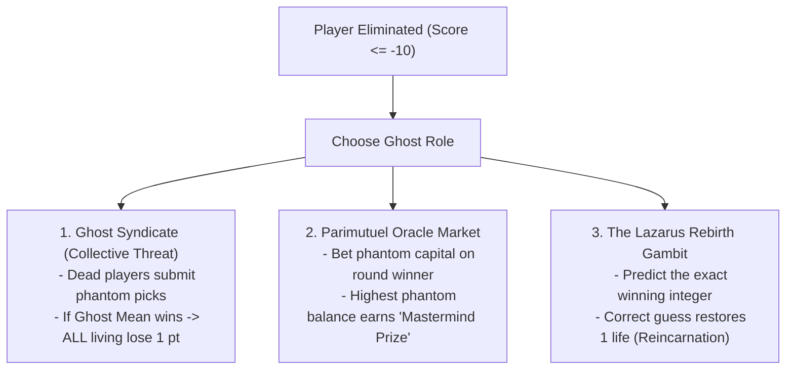

# Game Design & Rule Improvement Proposals
## KOD — The Beauty Contest (King of Diamonds)

---

## 1. Executive Summary & Core Game Dilemma

The **Keynesian Beauty Contest** ($p$-beauty contest) is celebrated in behavioral game theory and *Alice in Borderland* as the ultimate battle of iterated dominance, level-$k$ reasoning, and psychological profiling.

However, in real-world multiplayer play, standard implementations suffer from four critical game-design issues:
1. **Equilibrium Collapse (The Race to 0):** Pure rational play monotonically degrades toward the Nash Equilibrium ($0$), destroying strategic variety and turning repeated rounds into a sterile tie.
2. **Player Elimination Downtime:** Knocked-out players become passive spectators, draining room energy and engagement.
3. **The Kingmaker / Griefing Exploit:** Trailing players on their final life can intentionally submit extreme outliers ($100$ or $0$) to skew the arithmetic mean, deciding who dies with zero incentive to win.
4. **Information Monotony:** Instant, full revelation of player choices strips away opportunities for bluffing, social deduction, and deception.

This document synthesizes research across **Fandom Canon** (*Alice in Borderland* manga & Netflix series), **Behavioral Economics** (Nagel, Camerer, Thaler), and **Tabletop Game Design** (*Blood on the Clocktower*, *Dead Last*, *Wits & Wagers*) into concrete, actionable game rules and design enhancements.

---

## 2. Canonical Lore & Rule Mechanics (*Alice in Borderland*)

```
                      CANONICAL PROGRESSIVE RULE UNLOCKS
  ┌─────────────────────────────────────────────────────────────────────────────┐
  │ START (5 Players)     ──► Range [0, 100] | Target = 0.8 × Mean | Losers -1  │
  │ 1st ELIMINATION (4P)  ──► Rule 1: Duplicate Picks Voided & Penalized        │
  │ 2nd ELIMINATION (3P)  ──► Rule 2: Exact Target Match Doubles Penalty (-2)   │
  │ 3rd ELIMINATION (2P)  ──► Rule 3: 0 vs. 100 Inversion (100 Beats 0)         │
  └─────────────────────────────────────────────────────────────────────────────┘
```

### A. The 1v1 Strategic Triad (Rock-Paper-Scissors Matrix)
When only two players remain (Target $T = 0.4(X_1 + X_2)$):
* **$0$ beats $[1, 99]$:** $0$ is closer to $0.4X_2$ than $X_2$ is ($0.4X_2 < 0.6X_2$).
* **$[1, 99]$ beats $100$:** For any pick $X_2 \in [1, 99]$, $|0.6X_2 - 40| < 60 - 0.4X_2$.
* **$100$ beats $0$:** By special Rule 3 inversion.



### B. Canon Refinements for Competitive Play
1. **Float vs. Integer Precision:** Explicitly define exact-hit bonuses based on the **nearest rounded whole integer** (e.g. Target $22.93 \to 23$), or allow decimal inputs up to 2 places.
2. **All-Duplicate Deadlock Breaker:** If all living players submit duplicate numbers in a round, all receive $-1$ and all submitted numbers become sealed (banned) for the next round.

---

## 3. Mathematical & Game-Theoretic Improvements

To maintain strategic tension and prevent the game from decaying into $0$, the following mathematical structures can be introduced:

```
+------------------------------------+---------------------------------------+---------------------------------------------+
| Mechanism                          | Mathematical Formulation              | Behavioral Effect                           |
+------------------------------------+---------------------------------------+---------------------------------------------+
| **Affine Target Shift**            | Target $T = p \cdot \bar{s} + d$      | Moves the Nash Equilibrium from $0$ into an |
|                                    | (e.g., $T = 0.5\bar{s} + 25$)         | interior coordinate: $s^* = \frac{d}{1-p}$. |
|                                    |                                       | Players cannot simply camp at boundaries.   |
+------------------------------------+---------------------------------------+---------------------------------------------+
| **Dynamic Regime Multipliers**     | $p_t$ fluctuates across rounds        | Contractionary ($p<1$) pulls numbers down;  |
|                                    | ($p \in \{0.7, 1.25, -0.5\}$)         | Expansionary ($p>1$) races toward $100$;    |
|                                    |                                       | Negative ($p<0$) creates damped cobwebs.    |
+------------------------------------+---------------------------------------+---------------------------------------------+
| **Trimmed / Winsorized Mean**      | Discard highest & lowest $\alpha\%$   | Completely neutralizes kingmaker griefing   |
|                                    | before computing $\bar{s}$            | (spite picks of $100$ or $0$ are discarded).|
+------------------------------------+---------------------------------------+---------------------------------------------+
| **Median $\times p$ Target**       | Target $T = p \cdot \text{Median}(s)$ | Insulates against extreme outliers and      |
|                                    |                                       | shifts focus to the median voter's depth.   |
+------------------------------------+---------------------------------------+---------------------------------------------+
| **Quadratic Distance Scoring**     | $\Delta \text{Score} = K - c(s_i-T)^2$| Replaces binary win/loss with granular risk |
|                                    |                                       | management and confidence-weighted payoffs. |
+------------------------------------+---------------------------------------+---------------------------------------------+
```

---

## 4. Player Downtime & Elimination Agency

*Principle: Death is a role transition, not a game exit.*



### 1. The Ghost Syndicate ("The Haunt")
- Eliminated players continue submitting numbers each round.
- Their collective mean enters the calculation as an artificial contestant: **"The Phantom"** (weighted at $0.5\times$).
- **The Curse:** If the Phantom's pick is closest to the target, **all surviving players lose $1$ point**. Living contestants must actively calculate human psychology while anticipating the vengeful dead.

### 2. The Parimutuel Oracle Market
- Eliminated players receive 100 Phantom Chips and wager on:
  - *Who will win the round?* (Dynamic odds based on player standings).
  - *Macro Target Range:* Low ($<25$), Mid ($25\text{--}50$), or High ($>50$).
- The ghost with the highest bankroll at match end earns the **Underworld Mastermind** title.

### 3. The Lazarus Reincarnation Gambit
- If an eliminated player correctly guesses the *exact rounded target integer* during any live round, they instantly resurrect with $1$ life in "Revenge Mode."

---

## 5. Social Dynamics, Bluffing & Information Flow

### A. The Three-Phase Round Arc

```
┌───────────────────────────────┬───────────────────────────────┬───────────────────────────────┐
│     PHASE 1: THE AGORA        │     PHASE 2: THE VAULT        │     PHASE 3: RECKONING        │
│          (45 Seconds)         │          (15 Seconds)         │                               │
│  - Open room deliberation     │  - Strict silence enforced    │  - Cinematic scale tilt       │
│  - Public pledges & alliances │  - Secret number lock-in      │  - Running average cascade    │
│  - Collusion & baiting        │  - Last-second defections     │  - Exact hit / death verdicts │
└───────────────────────────────┴───────────────────────────────┴───────────────────────────────┘
```

* **Public Pledges & Truth Bounties:**
  - A player may declare a public pledge: *"My pick will be $\le 20$."*
  - If they honor the pledge and win, they gain a **$+1$ Shield** (negates their next point loss).
  - If they bluff and lose, they suffer an extra point deduction.
* **Secret Cartels:** Trailing players can verbally agree to submit high numbers (e.g. $85$) to pull the target upward and save each other—with the ever-present threat of backstabbing to $0$.

### B. Information Architecture & "Fog of War"
Instead of revealing every player's exact pick instantly, information can be modulated:
* **Anonymous Heatmap:** Show all chosen numbers on the number line without player names attached, fostering suspicion and finger-pointing.
* **Slow-Burn Cascade:** Reveal numbers in ascending order from lowest to highest, updating the running average live like a roulette wheel.
* **Asymmetric Radar:** Underdogs secretly receive one clue about an opponent (e.g. *"Player A picked an Odd number"*).

---

## 6. Action Modifiers & "Tarot / Suit" Cards

Each contestant receives a hand of 2–3 single-use action cards at match start:

* **Weight Modifiers:**
  * **Lead Anchor ($3\times$ Weight):** Your pick carries $3\times$ mathematical weight in the average—pulling the target toward your number.
  * **Ghost Echo ($0\times$ Weight):** Your pick does not affect the group average, but can still win the round.
* **Rule Inverters:**
  * **The Inverted Mirror:** For this round only, Target $= 1.25 \times \text{Average}$ (incentivizing high numbers).
  * **Anti-Target:** The player *furthest* from the target wins the round.
* **Defensive Wards:**
  * **Aegis Shield:** Absorb one point loss if you lose this round.
  * **Parasite Link:** Bind your fate to an opponent; if they survive without losing a point, you do too.

---

## 7. Four Turnkey Game Mode Presets

```
                              BEAUTY CONTEST GAME MODES
  ┌───────────────────────────┬───────────────────────────┬───────────────────────────┐
  │   1. BORDERLAND CANON     │   2. REVOLUTION & GHOSTS  │    3. MACRO STOCK MARKET  │
  │   - 0.8x Target           │   - Dead players form AI  │   - Fluctuation (p = 0.7/1.3)│
  │   - Duplicate voiding     │   - 45s debate / pledges  │   - Bankroll & Confidence │
  │   - Exact match -2        │   - Action Tarot Cards    │   - Trimmed Mean (Anti-grief)│
  │   - 100 beats 0 endgame   │   - Side-betting oracle   │   - Interior Affine shift │
  └───────────────────────────┴───────────────────────────┴───────────────────────────┘
```

### Mode 1: "King of Diamonds: Pure Canon" (Hardcore / High Tension)
* **Target:** $0.8 \times \text{Mean}$.
* **Health:** Starts at $0$, eliminated at $-10$. Losers $-1$.
* **Progressive Rules:**
  - $1^{\text{st}}$ Out: Duplicate choices voided & penalized.
  - $2^{\text{nd}}$ Out: Exact match doubles losers' penalty ($-2$).
  - Final 2: $100$ beats $0$.
  - Ties: Tied numbers sealed in subsequent round.

### Mode 2: "The Grand Court: Social & Ghost Syndicate" (Party / Streamer Play)
* **Structure:** 45s debate $\to$ 15s lock-in.
* **Ghost Syndicate:** Dead players enter as "The Phantom" ($0.5\times$ weight). If Phantom wins, all living take $-1$.
* **Tarot Cards:** 2 single-use cards per player.
* **Public Pledges:** Truthful winning pledges award $+1$ Shield.

### Mode 3: "Wall Street: Dynamic Market" (Deep Strategy & Bankrolls)
* **Regime Shifts:**
  - *Bull Market (30% chance):* Target $= 1.25 \times \text{Mean} - 10$ (Interior Equilibrium at $40$).
  - *Bear Market (70% chance):* Target $= 0.70 \times \text{Mean} + 15$ (Interior Equilibrium at $50$).
* **Trimmed Mean:** Top and bottom $10\%$ of picks are discarded before computing the average.
* **Wagering:** Players wager 1–3 life points based on prediction confidence.

### Mode 4: "Blitz Duel: Rapid Elimination" (Fast-Paced Casual)
* **Timer:** 15-second lightning rounds.
* **Health:** 5 life points.
* **Shrinking Range:** $[0, 100] \to [0, 50] \to [0, 25]$ as contestants fall.
* **Streak Bonus:** Winning 2 consecutive rounds restores $+1$ life.

---

## 8. Anti-Griefing & Competitive Integrity Rules

1. **Trimmed Mean Safeguard:** Automatically discard the extreme highest and lowest outliers when player count $\ge 6$ to prevent deliberate griefing by trailing players.
2. **Anti-Kingmaker Disqualification:** If a player with $\le -8$ points submits a pick deviating by $> 3\sigma$ from the group average without mathematical viability, their submission is flagged and excluded from the average calculation.
3. **Grace Margin for Underdogs:** Players on their final life point receive a $\pm 1.5$ grace distance allowance when evaluating closest-to-target.
